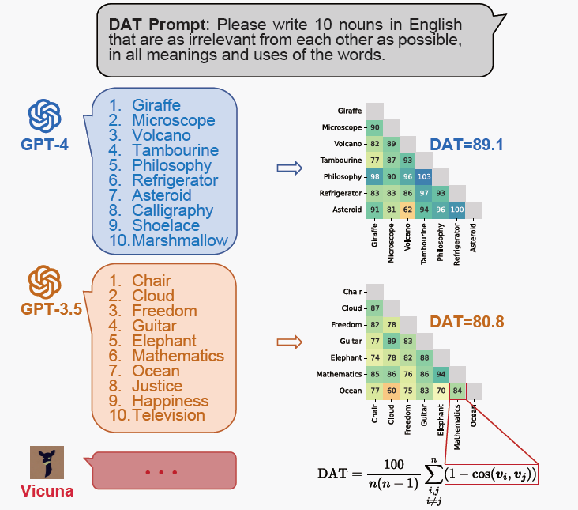
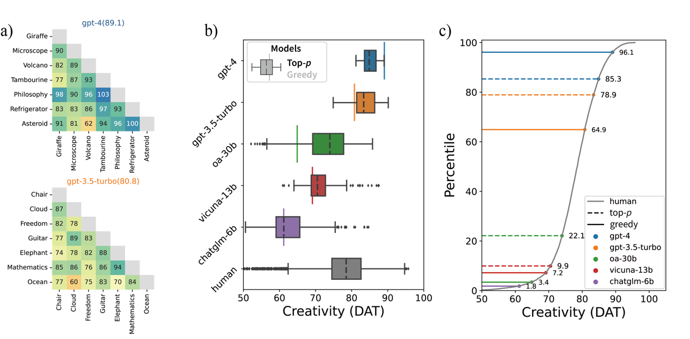
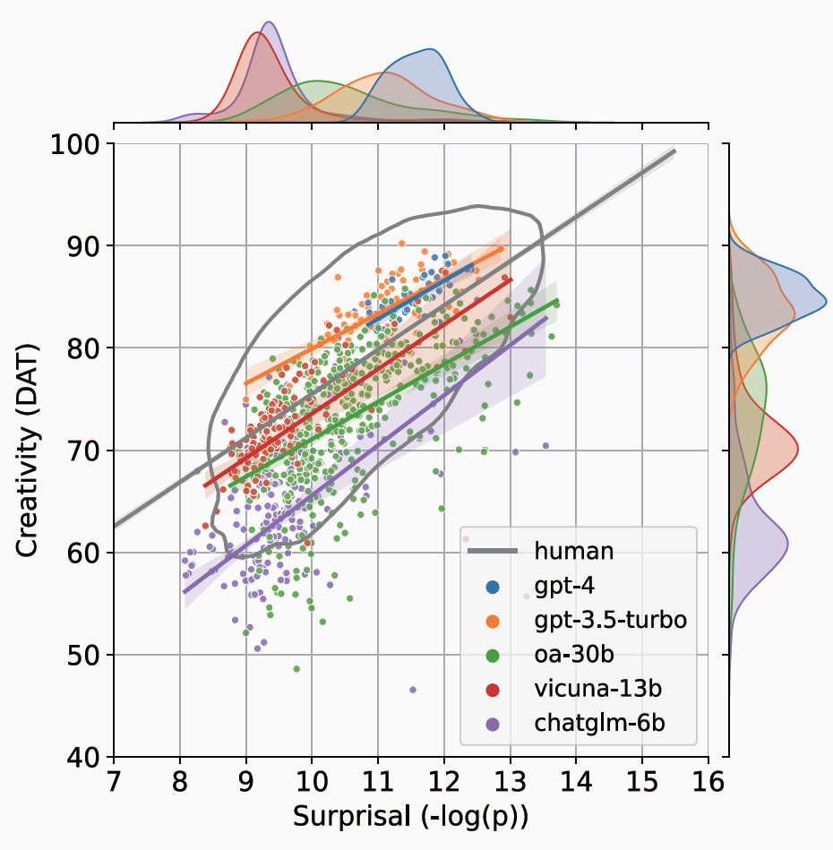

*"Creativity is the defeat of habit by originality."* --Arthur Koestler

Human progress stems from continuous innovation in technology, culture, and the arts. This creativity is one of the defining traits of what we consider intelligence. In language, creative expressions—such as metaphors, humor, and more—play a crucial role in communication and linguistic evolution. If humans can possess creativity, can language models like GPT-4 also exhibit it?  

At first glance, this seems unlikely: the essence of creativity lies in the ability to produce novel and applicable ideas, yet language models are trained on existing corpora—essentially fitting the distribution of human language that already exists. How, then, could such models generate anything truly original?  

However, current usage suggests that many people are indeed employing GPT-4 for creative tasks. For instance, mathematician Terence Tao has noted that GPT-4 assists him in solving problems and proving mathematical theorems. Some researchers have found that GPT-4 can produce literary works at a human level and even propose scientific hypotheses. If models can indeed perform creative work, how should we measure their creativity concretely?  

Recently, we has made some attempts to address this question [1](https://heiheihei730.github.io/publication/creativity/). This study developed a creativity evaluation for language models based on the Divergent Association Test (DAT). In psychology, researchers have devised numerous creativity assessments, but many of these tests may not be reliable when applied to models, as the test items might have leaked into the training data. If creativity is assessed purely based on output, models could also generate content by retrieving from their training corpora. These confounding factors make it difficult to discern a model’s true creative capacity. However, some evaluations approach creativity from a more cognitive perspective, measuring it through semantic retrieval flexibility—DAT being one such method [2].  

The DAT test requires generating 10 nouns that are as semantically unrelated as possible:  

> *"Generate 10 nouns that are as unrelated to each other as possible."*  

After obtaining the 10 words, the semantic distance between each pair is calculated and averaged to produce the final DAT score, which ranges from 0 to 200. A higher DAT score indicates stronger divergent associative ability. This test demands the ability to break away from the everyday distribution of language and produce distant semantic associations—a significant challenge for language models. Surprisingly, we found that while smaller models indeed fall short of human performance, the most advanced models today have reached or even surpassed the average human level. For example, GPT-4 outperformed 96.1% of humans.  

We also experimented with different generation methods: greedy search (selecting the highest-probability word) and top-p sampling (drawing from the top-p probable words). Sampling improved DAT scores for weaker models, but the gains were limited.  

But are the models truly that impressive? We identified an issue with the DAT test: the measurement of semantic distance relies on word embeddings, which are influenced by word frequency. Plotting word frequency against DAT scores revealed that lower-frequency words correlate with higher DAT scores. GPT-4 and GPT-3.5’s difference mainly lies in GPT-4’s tendency to generate lower-frequency words. After controlling for word frequency, both models still scored above average but only surpassed 61% (GPT-4) and 75% (GPT-3.5) of humans. Notably, previous DAT studies on humans did not regress out word frequency, yet the results still showed high validity and correlation with other creativity tests. This suggests that generating low-frequency words may itself be linked to creativity.  

The study further explored the models’ generation strategies and the validity of the DAT paradigm (details omitted here). In summary, we proposed a semantic network-based evaluation for large language models’ creativity, finding that state-of-the-art models perform above the human average on DAT tasks. Given the long-standing debates around defining and measuring creativity, our study only examines it from the perspective of semantic network flexibility. It does not conclusively prove that models possess creativity—especially specialized (Pro-C) or eminent (Big-C) creativity seen in only a few individuals. Nevertheless, such flexibility, both behaviorally and neurologically, is closely tied to creativity [3]. Moreover, the fact that a model trained to fit language distributions can step beyond them—following DAT’s instructions to generate unrelated words—is a delightful discovery.

### References  
1. Chen, H., & Ding, N. (2023). *Probing the “Creativity” of Large Language Models: Can models produce divergent semantic association?* Findings of EMNLP. https://aclanthology.org/2023.findings-emnlp.858/
2. Olson, J. A., Nahas, J., Chmoulevitch, D., Cropper, S. J., & Webb, M. E. (2021). *Naming unrelated words predicts creativity.* PNAS, 118(25), e2022340118. https://doi.org/10.1073/pnas.2022340118  
3. Beaty, R. E., Benedek, M., Silvia, P. J., & Schacter, D. L. (2016). *Creative Cognition and Brain Network Dynamics.* Trends in Cognitive Sciences, 20(2), 87–95. https://doi.org/10.1016/j.tics.2015.10.004